# Settld 

**"Every order, dispute-ready."**

Settld is a comprehensive merchant dispute-evidence platform featuring a robust **Web Dashboard** and a dedicated mobile companion app (**V1**). Built rapidly and reliably using **Codeplain**, Settld watches a merchant's mailbox to automatically turn order, payment, and shipping emails into proactive "evidence vaults." 

When a dispute arises, it drafts a response pack for quick review—whether you are deep-diving on the web or approving on the go.

## 🧠 How It Works

Settld operates seamlessly in the background, transforming a chaotic inbox into a structured evidence ledger. 

```mermaid
graph LR
    A[Merchant Mailbox<br/>Gmail / Outlook] -->|Reads| B[Settld Scans & Classifies<br/>AI + Rules Engine]
    B -->|Generates| C[Evidence Vault Built<br/>Per order, auto-linked]
    C -->|Monitors| D[Dispute Detected<br/>Signal from inbox]
    D -->|Drafts| E[Pack Generated<br/>Ready for review]
    
    style A fill:#e8f0fe,stroke:#4285f4,stroke-width:2px,color:#1B2430
    style B fill:#e6f4ea,stroke:#34a853,stroke-width:2px,color:#1B2430
    style C fill:#e6f4ea,stroke:#34a853,stroke-width:2px,color:#1B2430
    style D fill:#fef7e0,stroke:#fbbc04,stroke-width:2px,color:#1B2430
    style E fill:#e6f4ea,stroke:#34a853,stroke-width:2px,color:#1B2430
```

## ⚖️ The Impact

| BEFORE Settld | WITH Settld |
| :--- | :--- |
| ❌ Evidence scattered across inbox | ✅ Every order auto-evidenced |
| ❌ Manual search takes hours | ✅ Dispute packs in seconds |
| ❌ Deadlines missed | ✅ Beat every deadline |
| ❌ Lost revenue | ✅ Recover revenue |

## 🏗️ Platform Architecture 

### 1. The Web Dashboard (Mission Control)
The core web interface for merchants to manage their evidence infrastructure. Designed for deep dives, complex dispute resolution, and high-level analytics across all connected mailboxes and stores. 

### 2. V1 Mobile Companion (On-the-Go)
The iOS and Android companion app designed for speed built entirely with **BILT** 
* **Quick-Log Shipment:** A 1-tap floating action button to log tracking details directly from the shipping counter.
* **Push Notifications:** Instant alerts for approaching deadlines or new chargebacks.
* **Fast Approvals:** Review and approve auto-generated evidence packs in seconds between customers.

## 🎯 Core Features

* **Automated Evidence Vaults:** Scans read-only mailboxes to compile timelines of order confirmations, tracking, and delivery proof.
* **Dispute Signal Queue:** Alerts merchants to chargebacks or complaints with clear deadlines and evidence scores.
* **Explicit Approval Flow:** Never auto-submits. Requires explicit human review to approve dispute response packs.

## 🛠️ Built With Codeplain

Web dashboard built using **Codeplain**. with the Front end built with **V0** and hosted on **Vercel**

## 🎨 Design System & UI Rules

The UI relies on an **"evidence ledger"** aesthetic—precise, trustworthy, and paper-trail inspired.

* **Typography:** Serif display face (Fraunces) for headings, clean sans-serif (Inter) for UI, and monospace (IBM Plex Mono) for identifiers.
* **Visuals:** Card-based layouts, 1px hairline borders, small border radii (2–4px), and simple line icons. 
* **Colors:** Paper backgrounds (`#F7F3EA`), primary ink (`#1B2430`), and distinct status indicators (Green: `#2F6F4E`, Amber: `#C98A3A`, Red: `#A4402A`).
* **Hard Scope Rules:** * **No Auto-Actions:** Every outbound action requires a deliberate human tap and confirmation state.
    * **Visible Scoring:** Evidence scores (e.g., "92/100") must be visibly attached to all status labels.
    * **Not an Email Client:** Read/review/approve only. No compose or inbox browsing functionalities.
