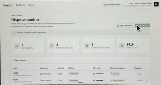

# Settld

**Every order, dispute-ready.**

Settld is a merchant dispute-evidence platform with a **Web Dashboard** and a **V1** mobile companion app. Built with **Codeplain**, it watches a merchant mailbox and turns order, payment, and shipping emails into evidence vaults.

When a dispute appears, it prepares a response pack for review on the web or on the go.

## 🧠 How It Works

Settld runs in the background and turns a chaotic inbox into a structured evidence ledger.

```mermaid
graph LR
    A[Merchant Mailbox<br/>Gmail / Outlook] -->|Reads| B[Settld Scans & Classifies<br/>AI + Rules Engine]
    B -->|Generates| C[Evidence Vault Built<br/>Per order, auto-linked]
    C -->|Monitors| D[Dispute Detected<br/>Signal from inbox]
    D -->|Drafts| E[Pack Generated<br/>Ready for review]
    
    style A fill:#e8f0fe,stroke:#4285f4,stroke-width:2px,color:#1B2430
    style B fill:#e6f4ea,stroke:#34a853,stroke-width:2px,color:#1B2430
    style C fill:#e6f4ea,stroke:#34a853,stroke-width:2px,color:#1B2430
    style D fill:#fef7e0,stroke:#fbbc04,stroke-width:2px,color:#1B2430
    style E fill:#e6f4ea,stroke:#34a853,stroke-width:2px,color:#1B2430
```

## ⚖️ The Impact

| BEFORE Settld | WITH Settld |
| :--- | :--- |
| ❌ Evidence scattered across inbox | ✅ Every order auto-evidenced |
| ❌ Manual search takes hours | ✅ Dispute packs in seconds |
| ❌ Deadlines missed | ✅ Beat every deadline |
| ❌ Lost revenue | ✅ Recover revenue |

## 🏗️ Platform Architecture

### 1. The Web Dashboard (Mission Control)
The core web interface for merchants to manage evidence infrastructure, deep-dive disputes, and review analytics across connected mailboxes and stores.

### 2. V1 Mobile Companion (On-the-Go)
The iOS and Android companion app for fast review, built entirely with **BILT**.
* **Quick-Log Shipment:** A 1-tap floating action button to log tracking details directly from the shipping counter.
* **Push Notifications:** Instant alerts for approaching deadlines or new chargebacks.
* **Fast Approvals:** Review and approve auto-generated evidence packs in seconds between customers.

## 🎯 Core Features

* **Automated Evidence Vaults:** Scans read-only mailboxes to compile timelines of order confirmations, tracking, and delivery proof.
* **Dispute Signal Queue:** Alerts merchants to chargebacks or complaints with clear deadlines and evidence scores.
* **Explicit Approval Flow:** Never auto-submits; every dispute response pack requires explicit human review.

## 🛠️ Built With Codeplain
The web dashboard and mobile UI were built using **Codeplain**. The web dashboard's front end uses **V0** and is hosted on **Vercel**.

## 🎨 Design System & UI Rules

The UI uses an **evidence ledger** aesthetic: precise, trustworthy, and paper-trail inspired.

* **Typography:** Serif display face (Fraunces) for headings, clean sans-serif (Inter) for UI, and monospace (IBM Plex Mono) for identifiers.
* **Visuals:** Card-based layouts, 1px hairline borders, small border radii (2–4px), and simple line icons.
* **Colors:** Paper backgrounds (`#F7F3EA`), primary ink (`#1B2430`), and distinct status indicators (Green: `#2F6F4E`, Amber: `#C98A3A`, Red: `#A4402A`).
* **Hard Scope Rules:**
  * **No Auto-Actions:** Every outbound action requires a deliberate human tap and confirmation state.
  * **Visible Scoring:** Evidence scores (e.g., "92/100") must be visibly attached to all status labels.
  * **Not an Email Client:** Read/review/approve only. No compose or inbox browsing functionality.
 
## **market signal** ## 

To validate the core problem, we conducted an informal in-person survey of ~100 people across central London and Shoreditch, asking about their experience and hesitations buying from independent sellers on platforms like Etsy and eBay.

Key findings:
93% want faster refunds when asked directly "Would you want faster refunds?" (7% said no).
The two most commonly cited reasons for not buying more often from independent/Etsy sellers were:

Slow/late refunds — uncertainty or long wait times when something goes wrong
Lack of buyer security — less confidence in dispute resolution compared to larger platforms (e.g. Amazon)

 
 ## Demo videos

### Demo 1

[Download original Demo 1 `.mov`](./Docs/IMG_0346.mov)

### Demo 2

[Download original Demo 2 `.mov`](./Docs/video2.mov)

